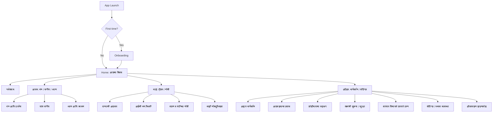
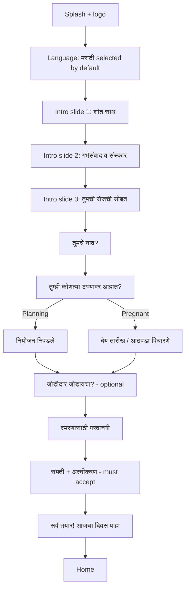

# Information Architecture, Sitemap & Navigation

## 1. Information architecture (IA) overview



**IA principles**
- Max 2 taps to any MVP feature from Home.
- Audio is reachable from Home and from a persistent mini-player.
- Health-adjacent screens always carry the disclaimer banner.
- Simple-mode toggle increases font size and reduces visual density.

---

## 2. Full sitemap

```
गर्भयात्रा (App)
├── Onboarding
│   ├── भाषा निवड (Language: Marathi default)
│   ├── स्वागत स्क्रीन्स (3 intro slides)
│   ├── नाव विचारणे (Name)
│   ├── टप्पा निवड (Stage: Planning / T1 / T2 / T3)
│   ├── देय तारीख / आठवडा (Due date / week — optional)
│   ├── जोडीदार जोडायचा? (Partner link — optional)
│   ├── स्मरण परवानगी (Notification permission)
│   ├── संमती व अस्वीकरण (Consent + Disclaimer)
│   └── तयार! (Ready / first Today preview)
│
├── Tab 1: आजचा दिवस (Home / Today)
│   ├── शुभेच्छा हेडर (greeting + week/day)
│   ├── आजची प्रेरणा (Affirmation card)
│   ├── आजचा गर्भसंवाद (Garbh samvad card → detail)
│   ├── आजचे ध्यान / श्वसन (Meditation card → player)
│   ├── आजचे संगीत / मंत्र (Audio suggestion → player)
│   ├── आजची दिनचर्या checklist (routine tasks)
│   ├── झटपट ट्रॅकर (water + mood quick add)
│   └── आजची टीप (diet/wellness tip + disclaimer)
│
├── Tab 2: गर्भसंवाद (Garbh Samvad)
│   ├── आजचा संवाद (today's script: text + audio)
│   ├── संवाद संग्रह (library by week/theme)
│   ├── जोडीदारासाठी संवाद (partner scripts)
│   └── रेकॉर्ड करा (optional: record your own voice — local)
│
├── Tab 3: आराम (Calm Hub)
│   ├── मंत्र आणि प्रार्थना (Mantra & Prayer)
│   │   └── [audio list] → Player
│   ├── शांत संगीत (Calm Music)
│   │   └── [audio list] → Player
│   ├── ध्यान आणि श्वसन (Meditation & Breathing)
│   │   ├── श्वसन व्यायाम (guided breathing animation)
│   │   └── ध्यान सत्रे (meditation sessions) → Player
│   └── झोपण्यापूर्वी (Bedtime: lullaby/story — Phase 2)
│
├── Tab 4: माझे (Me / Trackers)
│   ├── पाण्याची आठवण (Water tracker)
│   ├── आईची मन:स्थिती (Mood tracker + history)
│   ├── वजन व भेटीच्या नोंदी (Weight & appointments)
│   ├── माझी नोंदपुस्तिका (Journal / gratitude)
│   ├── आठवड्याचा प्रवास (Weekly journey + baby summary)
│   └── माझी प्रगती (streaks / gentle progress)
│
└── Tab 5: अधिक (More)
    ├── आहार मार्गदर्शन (Diet guidance)
    ├── जोडीदाराचा सहभाग (Partner participation)
    ├── स्मरण व्यवस्था (Reminders manager)
    ├── ऑफलाइन डाउनलोड (Offline content manager)
    ├── तज्ञांची सूचना व सुरक्षा (Safety & disclaimer)
    ├── वारंवार विचारले जाणारे प्रश्न (FAQ)
    ├── सेटिंग्ज (Settings: font size, theme, language, profile)
    ├── गोपनीयता धोरण (Privacy policy)
    └── गर्भयात्रा प्लस (Premium / subscription)
```

---

## 3. Bottom navigation structure (5 tabs)

| Position | Marathi label | Icon idea | Destination |
|---|---|---|---|
| 1 | आजचा दिवस | Sun / lotus | Home/Today |
| 2 | गर्भसंवाद | Sound waves + heart | Garbh samvad |
| 3 | आराम | Moon / diya | Calm hub (mantra/music/meditation) |
| 4 | माझे | Person / leaf | Trackers + journal |
| 5 | अधिक | Three dots / menu | More (diet, partner, settings, safety) |

- **Persistent mini audio player** sits above the bottom nav whenever audio is playing.
- **Center tab emphasis** optional: आराम could be a raised center FAB for "quick calm".
- Accessibility: labels always visible (not icon-only), min 48dp targets.

---

## 4. Onboarding flow (detailed)



**Onboarding rules**
- Skippable steps: name, due date, partner, notifications. **Not skippable:** consent + disclaimer.
- Stage drives all subsequent content (see daily routine engine).
- If due date unknown, allow "अंदाजे आठवडा" or "मला माहीत नाही" → defaults to gentle generic content + suggests asking doctor.
- Age gate: confirm user is 18+ (adult).
- Store preferences locally + sync if account created.

---

## 5. Home screen wireframe (description)

```
┌─────────────────────────────────────────┐
│  ☰        गर्भयात्रा            🔔  ⚙   │  ← top bar (menu, title, reminders, settings)
├─────────────────────────────────────────┤
│  नमस्कार, प्राजक्ता 🌸                     │  ← greeting (name)
│  गर्भारपणाचा १२ वा आठवडा · दिवस ८४        │  ← week/day chip
├─────────────────────────────────────────┤
│  ┌─────────────────────────────────────┐ │
│  │ ✨ आजची प्रेरणा                       │ │  ← Affirmation card (soft saffron)
│  │ "मी शांत आहे, माझे बाळ सुरक्षित आहे." │ │
│  │            ▶ ऐका     ↗ शेअर करा       │ │
│  └─────────────────────────────────────┘ │
│  ┌─────────────────────────────────────┐ │
│  │ 💬 आजचा गर्भसंवाद          ▶ ५ मिनिटे │ │  ← Garbh samvad card (blush)
│  └─────────────────────────────────────┘ │
│  ┌──────────────┐  ┌──────────────────┐  │
│  │ 🌬 श्वसन      │  │ 🎵 शांत संगीत     │  │  ← 2-up cards
│  │   ३ मिनिटे    │  │   ऐकत राहा        │  │
│  └──────────────┘  └──────────────────┘  │
│  ┌─────────────────────────────────────┐ │
│  │ ✅ आजची दिनचर्या             ३/५     │ │  ← routine checklist
│  │ ◻ सकाळचे ध्यान                       │ │
│  │ ◻ पाणी प्या (६/८)                    │ │
│  │ ◻ हलका योग                           │ │
│  └─────────────────────────────────────┘ │
│  ┌────────┐ ┌────────┐ ┌──────────────┐  │
│  │ 💧 पाणी │ │ 😊 मन   │ │ 📖 नोंद      │  │  ← quick trackers
│  └────────┘ └────────┘ └──────────────┘  │
│  ┌─────────────────────────────────────┐ │
│  │ 🍃 आजची टीप: ...                     │ │  ← tip + disclaimer footer
│  │ ⓘ कृपया डॉक्टरांचा सल्ला घ्या.        │ │
│  └─────────────────────────────────────┘ │
├─────────────────────────────────────────┤
│  ▶ आता वाजत आहे: गायत्री मंत्र   ⏸  ✕    │  ← mini player (when active)
├─────────────────────────────────────────┤
│ आजचा दिवस│गर्भसंवाद│ आराम │ माझे │ अधिक │  ← bottom nav
└─────────────────────────────────────────┘
```

**Home behaviors**
- Cards are reorderable in Phase 2 (personalized schedule).
- Pull-to-refresh re-fetches today's content (works offline from cache).
- Empty/loading states use gentle illustrations, never harsh errors.
- Disclaimer footer is always visible on Home.
