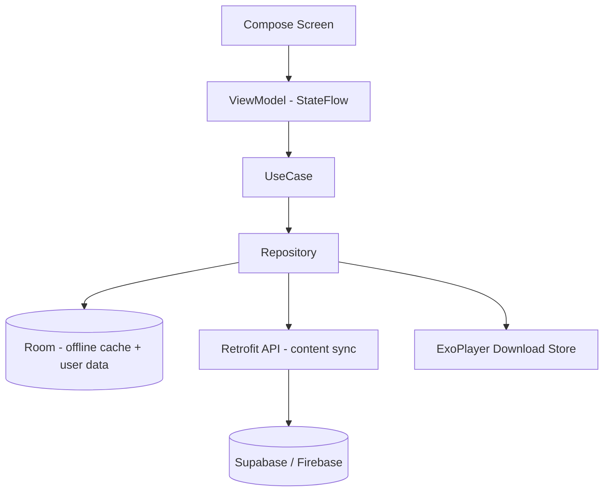

# Android Architecture, Backend, APIs & AI Roadmap

## 1. Tech stack recommendation (Android)

| Layer | Choice | Why |
|---|---|---|
| Language | **Kotlin** | Modern, official, null-safe |
| UI | **Jetpack Compose** + Material 3 | Declarative, themable, accessible, fast to build |
| Architecture | **MVVM + Clean Architecture** (UI → ViewModel → UseCase → Repository → Data) | Testable, scalable |
| DI | **Hilt** | Standard DI for Android |
| Async | **Coroutines + Flow** | Reactive streams, lifecycle-safe |
| Local DB | **Room** | Offline content + user data, SQL, type-safe |
| Key-value | **DataStore (Preferences)** | Settings, prefs, onboarding flags |
| Audio | **Media3 / ExoPlayer** + `MediaSessionService` | Background playback, offline, mini-player |
| Reminders | **WorkManager** + **AlarmManager** | Periodic + exact reminders, reboot-safe |
| Push | **Firebase Cloud Messaging (FCM)** | Re-engagement, announcements |
| Images/illustrations | **Coil** | Compose-native image loading |
| Networking | **Retrofit + OkHttp + Kotlinx Serialization** | Content sync API |
| Offline media | ExoPlayer **download manager** + Room metadata | Offline audio packs |
| Analytics | **Firebase Analytics** (+ optional self-host) | KPIs, privacy-conscious |
| Crash | **Firebase Crashlytics** | Stability |
| Auth | **Supabase Auth** or **Firebase Auth** (phone/email/anon) | Low-friction, India phone-first |
| Billing | **Google Play Billing Library** | Subscriptions |
| Localization | Compose string resources + content `lang` field | Marathi-first |
| Accessibility | Compose semantics, TalkBack, dynamic font scaling | Inclusive |
| Testing | JUnit, Turbine, Compose UI tests, Roborazzi (screenshot) | Quality |
| Min SDK | **API 24 (Android 7.0)** | Broad India device coverage |
| Target SDK | latest stable | Play requirement |

### 1.1 Module structure (Gradle)
```
:app                      // entry, navigation, DI wiring
:core:ui                  // theme, design system, Compose components
:core:common              // utils, result types, dispatchers
:core:data               // Room, DataStore, network, repos
:core:domain              // use cases, models
:feature:onboarding
:feature:today            // आजचा दिवस + routine engine
:feature:samvad
:feature:calm             // mantra/music/meditation + player
:feature:trackers         // water/mood/weight/journal
:feature:weekly
:feature:more             // diet/partner/settings/safety/faq
:feature:reminders
:feature:offline
:feature:premium
```

### 1.2 Data flow

**Offline-first:** Repository reads Room first, syncs from network when available. Daily plan assembled on-device. Audio plays from local store when downloaded.

---

## 2. Backend recommendation

### 2.1 Recommended: **Supabase** (primary) + **Firebase** (push/analytics)
| Need | Service |
|---|---|
| Relational content (days, content items, trimester mapping) | **Supabase Postgres** |
| Auth (phone/email/anonymous) | Supabase Auth |
| Media storage (audio files) | Supabase Storage (or Cloudflare R2/S3 + CDN for large audio) |
| Row-level security on user data | Supabase RLS |
| Push notifications | **Firebase FCM** |
| Analytics + Crashlytics | **Firebase** |
| Edge functions (content APIs, billing webhook) | Supabase Edge Functions |

**Why Supabase over Firestore here:** content is relational (days ↔ items ↔ trimester ↔ tags), making Postgres queries + admin editing simpler. Firestore is fine if you prefer a fully Google stack — schema is provided for both in [06-data-model.md](06-data-model.md).

### 2.2 Alternative: full Firebase
- Firestore (content + user data), Firebase Auth, Storage, FCM, Analytics, Remote Config (feature flags), Cloud Functions (billing/content). Simpler ops, but relational content modeling is more manual.

### 2.3 Media/CDN
- Audio stored in object storage; served via CDN with signed URLs (premium gating). Pre-generate compressed AAC (~64–96kbps) for low-bandwidth India users + optional higher-quality for premium.

---

## 3. Admin panel (content authoring)

| Option | Notes |
|---|---|
| **Supabase Studio** | Free, direct table editing for early stage |
| **Retool / Appsmith** | Fast internal admin with forms, audio upload, publish workflow |
| **Custom Next.js admin** | Best long-term: Marathi content editor, audio upload, review/approve workflow, versioning, scheduling, role-based access (author/reviewer/medical-advisor/publisher) |

**Admin must support:** create/edit content per type & stage, upload audio, set `review_date`/`reviewed_by`/`status`, schedule publish, manage 30-day plans, feature flags, and **block disallowed content** (validation rules rejecting gender/medical-claim keywords as a soft guardrail).

---

## 4. API list

> Base: `https://api.garbhyatra.app/v1`. Auth via Bearer JWT (Supabase). All content endpoints support `?lang=mr` and `If-None-Match` (ETag) for offline caching.

### 4.1 Auth & profile
| Method | Path | Purpose |
|---|---|---|
| POST | `/auth/otp/request` | Request phone OTP |
| POST | `/auth/otp/verify` | Verify OTP → JWT |
| POST | `/auth/anonymous` | Anonymous session (try before signup) |
| GET | `/me` | Get profile |
| PUT | `/me` | Update profile (name, stage, due date, prefs) |
| DELETE | `/me` | Delete account + data (DPDP compliance) |
| GET | `/me/export` | Export user data (JSON) |

### 4.2 Partner
| Method | Path | Purpose |
|---|---|---|
| POST | `/partner/invite` | Create invite code/link |
| POST | `/partner/accept` | Accept invite, link profiles |
| DELETE | `/partner/unlink` | Unlink partner |

### 4.3 Content (read-mostly, cacheable)
| Method | Path | Purpose |
|---|---|---|
| GET | `/content/today?date=&stage=&week=` | Assembled day plan (server fallback; client can assemble offline) |
| GET | `/content/items?type=&stage=&tag=&page=` | Content library (affirmations, samvad, mantra, music, meditation, tips) |
| GET | `/content/items/{id}` | Single content item + media URL |
| GET | `/content/days?stage=&from=&to=` | Day-plan templates (e.g., 30-day program) |
| GET | `/content/weekly/{week}?stage=` | Weekly baby/mother summary (non-diagnostic) |
| GET | `/content/manifest?stage=&since=` | Delta manifest for offline sync (ids, versions, etags) |
| GET | `/content/packs?stage=` | Offline downloadable packs (list + sizes) |
| GET | `/media/sign?itemId=` | Signed media URL (premium gated) |

### 4.4 User data (private, RLS-protected)
| Method | Path | Purpose |
|---|---|---|
| GET/POST | `/tracker/water` | Read/add water entries |
| GET/POST | `/tracker/mood` | Read/add mood entries |
| GET/POST/PUT/DELETE | `/tracker/weight` | Weight notes |
| GET/POST/PUT/DELETE | `/appointments` | Appointment notes |
| GET/POST/PUT/DELETE | `/journal` | Journal/gratitude entries |
| GET/POST | `/routine/complete` | Mark routine task done (for streaks) |
| GET/PUT | `/reminders` | Reminder preferences |
| GET/POST | `/offline/registry` | Track downloaded item ids (per device) |

### 4.5 Subscription
| Method | Path | Purpose |
|---|---|---|
| GET | `/billing/status` | Current entitlement |
| POST | `/billing/play/verify` | Verify Google Play purchase token |
| POST | `/billing/play/webhook` | Play RTDN webhook (server) |

### 4.6 Misc
| Method | Path | Purpose |
|---|---|---|
| GET | `/config/flags` | Feature flags / remote config |
| GET | `/faq?lang=mr` | FAQ content |
| POST | `/report` | Report content/issue |
| POST | `/feedback` | User feedback / NPS |

### 4.7 Sample response — `/content/today`
```json
{
  "date": "2026-06-22",
  "stage": "t1",
  "week": 12,
  "dayIndex": 5,
  "disclaimer": "ही माहिती सर्वसाधारण आहे. कृपया तुमच्या डॉक्टरांचा सल्ला घ्या.",
  "slots": {
    "affirmation": { "id": "aff_t1_005", "text": "मी शांत आहे, माझे बाळ सुरक्षित आहे.", "audioUrl": "..." },
    "garbhSamvad": { "id": "gs_w12_01", "title": "ओळख", "minutes": 5, "audioUrl": "...", "text": "..." },
    "meditation": { "id": "med_t1_003", "minutes": 3, "audioUrl": "..." },
    "audio": { "id": "mantra_001", "type": "mantra", "title": "गायत्री मंत्र", "premium": true },
    "tip": { "id": "tip_t1_005", "text": "...", "category": "rest" },
    "routine": [
      { "id": "rt_water", "title": "पाणी प्या", "target": 8 },
      { "id": "rt_breathe", "title": "सकाळचे श्वसन" },
      { "id": "rt_samvad", "title": "गर्भसंवाद" }
    ],
    "partnerTask": { "id": "pt_005", "text": "आज बाळाशी ५ मिनिटं बोला." }
  }
}
```

---

## 5. Firebase / Supabase integration suggestion

**Recommended hybrid:**
- **Supabase** → Postgres content, Auth, Storage, RLS, Edge Functions, billing verification.
- **Firebase** → FCM (push), Analytics, Crashlytics, Remote Config (feature flags / kill-switch).

**Client integration notes**
- Single `SyncManager` uses `/content/manifest` to pull deltas into Room.
- `MediaDownloadManager` (ExoPlayer) downloads premium/offline audio, registers in Room.
- `EntitlementManager` merges Play Billing + `/billing/status`.
- `RemoteConfig` toggles features without release (community, AI, packs).
- All user-data writes are offline-queued and synced when online.

---

## 6. Future AI features (Phase 3 roadmap)

| Feature | Description | Privacy approach |
|---|---|---|
| **Marathi voice companion** | Conversational guided sessions (TTS + optional STT) that read garbh samvad, lead breathing, answer non-medical FAQ. | On-device TTS where possible; server LLM with strict non-medical guardrails; never diagnoses. |
| **Personalized daily schedule** | AI orders/recommends routine cards based on engagement, mood trends, time-of-day. | On-device signals; minimal data to server; explainable. |
| **Smart reminders** | Learn best times, suppress completed, respect quiet hours. | On-device learning preferred. |
| **Journaling prompts** | Context-aware gentle prompts; sentiment-aware support nudges (never diagnosis). | Process locally; flag only to suggest professional help. |
| **Adaptive affirmations** | Generate/select affirmations matching mood trend. | Curated + reviewed pool; AI selects, doesn't fabricate medical content. |
| **Content safety classifier** | Auto-screen any UGC/community for banned topics (gender/superstition/medical claims). | Server-side moderation. |

**AI guardrails (mandatory):** system prompts forbid medical advice, diagnosis, gender topics, superstition; always append doctor disclaimer; escalate distress to "consult a professional / helpline"; human-reviewed content pools; no training on private user journals without explicit consent.
