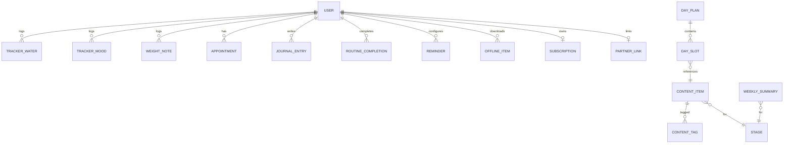

# Data Model / Entity Schema

## 1. Entity relationship overview



---

## 2. Core enums

```
Stage         = planning | t1 | t2 | t3
ContentType   = affirmation | garbh_samvad | meditation | mantra | music | tip | partner_task | routine_task
Mood          = happy | calm | tired | anxious | sad | energetic
ReminderType  = water | samvad | meditation | affirmation | mood | appointment | sleep | custom
ContentStatus = draft | in_review | approved | published | archived
Entitlement   = free | plus
```

---

## 3. Postgres (Supabase) schema — content

```sql
-- Stages reference (static)
create table stage (
  code text primary key,           -- planning | t1 | t2 | t3
  label_mr text not null,
  week_start int,
  week_end int
);

-- Content items (affirmation, samvad, mantra, music, meditation, tip, partner_task)
create table content_item (
  id text primary key,             -- e.g. aff_t1_005
  type text not null,              -- ContentType
  stage text references stage(code),
  lang text not null default 'mr',
  title_mr text,
  body_mr text,                    -- script/affirmation/tip text
  meaning_mr text,                 -- for mantra meaning
  audio_url text,
  audio_duration_sec int,
  image_url text,
  is_premium boolean default false,
  is_offline_eligible boolean default true,
  week int,                        -- for week-aligned samvad/summary
  day_index int,                   -- for fixed-program days
  status text not null default 'draft',
  version int not null default 1,
  author text,
  reviewed_by text,
  review_date date,
  created_at timestamptz default now(),
  updated_at timestamptz default now()
);

create table content_tag (
  content_id text references content_item(id) on delete cascade,
  tag text not null,               -- rest, hydration, bonding, devotional, breathing...
  primary key (content_id, tag)
);

-- Day plan templates (e.g., the 30-day program)
create table day_plan (
  id text primary key,             -- e.g. day_t1_005
  stage text references stage(code),
  day_index int not null,
  title_mr text,
  disclaimer_mr text not null
);

create table day_slot (
  id bigserial primary key,
  day_plan_id text references day_plan(id) on delete cascade,
  slot text not null,              -- affirmation|garbhSamvad|meditation|audio|tip|partnerTask
  content_id text references content_item(id),
  position int default 0
);

create table day_routine_task (
  id bigserial primary key,
  day_plan_id text references day_plan(id) on delete cascade,
  task_key text not null,          -- rt_water, rt_breathe, rt_samvad...
  title_mr text not null,
  target int,                      -- e.g. water glasses
  deep_link text
);

-- Weekly non-diagnostic summary
create table weekly_summary (
  id text primary key,             -- wk_12
  stage text references stage(code),
  week int not null,
  baby_summary_mr text,
  size_compare_mr text,            -- "लिंबाएवढं" general analogy
  mother_changes_mr text,
  disclaimer_mr text not null,
  status text default 'draft',
  reviewed_by text,
  review_date date
);

-- Offline packs
create table offline_pack (
  id text primary key,
  stage text references stage(code),
  title_mr text,
  size_bytes bigint,
  is_premium boolean default true
);
create table offline_pack_item (
  pack_id text references offline_pack(id) on delete cascade,
  content_id text references content_item(id),
  primary key (pack_id, content_id)
);
```

---

## 4. Postgres schema — user data (RLS protected)

```sql
create table app_user (
  id uuid primary key default gen_random_uuid(),
  phone text unique,
  name_mr text,
  stage text references stage(code),
  due_date date,
  week_at_signup int,
  prefs jsonb default '{}',         -- devotional, audioType, fontSize, simpleMode, theme
  consent_accepted_at timestamptz,
  is_adult boolean default false,
  created_at timestamptz default now()
);

create table partner_link (
  id uuid primary key default gen_random_uuid(),
  mother_id uuid references app_user(id) on delete cascade,
  partner_id uuid references app_user(id) on delete cascade,
  status text default 'pending',    -- pending | active
  created_at timestamptz default now()
);

create table tracker_water (
  id bigserial primary key,
  user_id uuid references app_user(id) on delete cascade,
  date date not null,
  glasses int not null default 0,
  goal int default 8,
  updated_at timestamptz default now(),
  unique(user_id, date)
);

create table tracker_mood (
  id bigserial primary key,
  user_id uuid references app_user(id) on delete cascade,
  date date not null,
  mood text not null,               -- Mood enum
  note_mr text,
  created_at timestamptz default now()
);

create table weight_note (
  id bigserial primary key,
  user_id uuid references app_user(id) on delete cascade,
  date date not null,
  weight_kg numeric(5,2),
  note_mr text
);

create table appointment (
  id bigserial primary key,
  user_id uuid references app_user(id) on delete cascade,
  date_time timestamptz not null,
  doctor_mr text,
  place_mr text,
  note_mr text,
  remind boolean default true
);

create table journal_entry (
  id bigserial primary key,
  user_id uuid references app_user(id) on delete cascade,
  date date not null,
  type text default 'free',         -- free | gratitude
  body_mr text,
  created_at timestamptz default now()
);

create table routine_completion (
  id bigserial primary key,
  user_id uuid references app_user(id) on delete cascade,
  date date not null,
  task_key text not null,
  completed_at timestamptz default now(),
  unique(user_id, date, task_key)
);

create table reminder (
  id bigserial primary key,
  user_id uuid references app_user(id) on delete cascade,
  type text not null,               -- ReminderType
  enabled boolean default true,
  time_local time,                  -- for daily
  interval_min int,                 -- for water
  window_start time,
  window_end time,
  repeat_days int[],                -- 0-6
  payload jsonb default '{}'
);

create table offline_item (
  user_id uuid references app_user(id) on delete cascade,
  content_id text references content_item(id),
  device_id text,
  downloaded_at timestamptz default now(),
  primary key (user_id, content_id, device_id)
);

create table subscription (
  user_id uuid primary key references app_user(id) on delete cascade,
  entitlement text default 'free',  -- free | plus
  plan text,                        -- monthly | quarterly | full | lifetime
  play_purchase_token text,
  expires_at timestamptz,
  updated_at timestamptz default now()
);
```

### 4.1 Row-level security (concept)
```sql
alter table journal_entry enable row level security;
create policy "own rows" on journal_entry
  using (user_id = auth.uid()) with check (user_id = auth.uid());
-- repeat for all user-data tables
```

---

## 5. Room (Android local) entities — key tables

```kotlin
@Entity
data class ContentItemEntity(
  @PrimaryKey val id: String,
  val type: String, val stage: String, val lang: String,
  val titleMr: String?, val bodyMr: String?, val meaningMr: String?,
  val audioUrl: String?, val audioDurationSec: Int?, val imageUrl: String?,
  val isPremium: Boolean, val isOfflineEligible: Boolean,
  val week: Int?, val dayIndex: Int?, val version: Int, val updatedAt: Long
)

@Entity data class DayPlanEntity(@PrimaryKey val id: String, val stage: String, val dayIndex: Int, val titleMr: String?, val disclaimerMr: String)
@Entity data class WaterEntity(@PrimaryKey(autoGenerate=true) val id: Long=0, val date: String, val glasses: Int, val goal: Int)
@Entity data class MoodEntity(@PrimaryKey(autoGenerate=true) val id: Long=0, val date: String, val mood: String, val noteMr: String?)
@Entity data class JournalEntity(@PrimaryKey(autoGenerate=true) val id: Long=0, val date: String, val type: String, val bodyMr: String)
@Entity data class RoutineCompletionEntity(@PrimaryKey val key: String /* date+task */, val date: String, val taskKey: String, val completedAt: Long)
@Entity data class ReminderEntity(@PrimaryKey(autoGenerate=true) val id: Long=0, val type: String, val enabled: Boolean, val timeLocal: String?, val intervalMin: Int?, val repeatDays: String?)
@Entity data class OfflineItemEntity(@PrimaryKey val contentId: String, val localPath: String, val downloadedAt: Long)
```

**Sync key:** `content_item.version` + `/content/manifest` drive incremental Room updates. User-data writes are queued locally and pushed when online (last-write-wins per row + `updated_at`).

---

## 6. Firestore alternative (if all-Firebase)

```
content_items/{id}            // type, stage, fields...
day_plans/{stage}/days/{dayIndex}
weekly_summaries/{stage}_{week}
users/{uid}                   // profile, prefs, subscription
users/{uid}/water/{date}
users/{uid}/mood/{autoId}
users/{uid}/journal/{autoId}
users/{uid}/appointments/{autoId}
users/{uid}/reminders/{autoId}
users/{uid}/routine/{date}_{taskKey}
partner_links/{linkId}
```
Security rules: users can only read/write their own `users/{uid}/**`; content is read-only public (premium gated via Cloud Function signed URLs).

See [content/schema.json](../content/schema.json) for the content ingestion JSON schema and [content/days-01-30.json](../content/days-01-30.json) for sample data.
