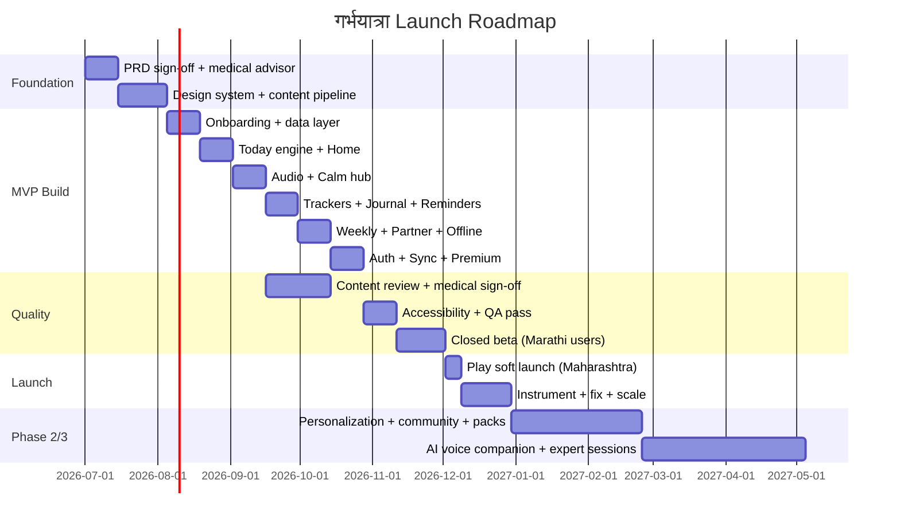

# Developer Handoff, QA Checklist & Launch Roadmap

## 1. Developer handoff notes

### 1.1 Build order (MVP)
1. **Foundation:** project setup, modules, theme/design system ([07-design-system.md](07-design-system.md)), navigation scaffold, Marathi string resources, font integration (Noto Sans Devanagari + Mukta).
2. **Onboarding:** language → intro → name → stage → due date → partner → notifications → consent/disclaimer → ready. Persist to DataStore + create profile.
3. **Local data layer:** Room entities ([06-data-model.md](06-data-model.md)), DataStore prefs, repositories, seed content ingestion from [content/days-01-30.json](../content/days-01-30.json) via [content/schema.json](../content/schema.json).
4. **Daily routine engine:** deterministic day-plan builder ([04-content-strategy.md](04-content-strategy.md) §2), offline-first.
5. **Home (आजचा दिवस):** cards (affirmation, samvad, meditation, audio, routine checklist, quick trackers, tip + disclaimer).
6. **Audio:** Media3/ExoPlayer + MediaSessionService, mini-player, full player, offline download manager.
7. **Calm hub:** mantra/music/meditation lists + breathing animation.
8. **Garbh samvad:** today + library + partner scripts + optional local recording.
9. **Trackers:** water, mood, weight, appointments, journal (Room CRUD + history).
10. **Weekly journey:** non-diagnostic summaries from content.
11. **Reminders:** WorkManager + AlarmManager + notification channels + boot reschedule.
12. **More:** diet, partner, settings (font/theme/simple mode/language), safety, FAQ, privacy.
13. **Offline manager:** packs + per-item download registry.
14. **Sync + Auth:** Supabase auth, manifest-based content sync, user-data sync queue.
15. **Premium:** Play Billing + entitlement gating.
16. **Instrumentation:** Analytics + Crashlytics + feature flags.

### 1.2 Key conventions
- **Strings:** every user-facing string in `strings.xml` (Marathi) — no hardcoded text. Source UX copy: [03-ux-copy-marathi.md](03-ux-copy-marathi.md).
- **Disclaimer:** reusable `DisclaimerBanner`; mandatory on all health-adjacent screens.
- **Offline-first:** read Room first; network is a sync source. Daily plan built on-device.
- **Deep links:** `app://...` scheme used in routine tasks (see JSON) → route to features.
- **Accessibility:** semantics + contentDescription on every interactive/visual element; test TalkBack + 200% font.
- **No banned content:** engine/content validators reject gender/superstition/medical-claim keywords.
- **Money/secrets:** verify Play purchases server-side; never trust client entitlement alone.

### 1.3 Content pipeline
- Authors edit in admin → review → medical sign-off → publish (versioned).
- App pulls via `/content/manifest` deltas into Room; audio via signed URLs (premium-gated) + offline download.
- Seed bundle ships in-app assets for first-run offline experience (day 1–7 minimum).

### 1.4 Definition of Done (per feature)
- [ ] Marathi strings complete, no hardcoded text.
- [ ] Offline behavior verified.
- [ ] Disclaimer present where applicable.
- [ ] Accessibility (TalkBack + large font) passes.
- [ ] Unit + UI tests for core logic.
- [ ] Analytics events added.
- [ ] No banned content paths.

---

## 2. QA checklist

### 2.1 Functional
- [ ] Onboarding completes for all stages (planning/T1/T2/T3) and "मला खात्री नाही" due date.
- [ ] Consent + 18+ checks gate entry; cannot skip.
- [ ] आजचा दिवस renders correct stage/day content; deterministic across app restarts.
- [ ] No-repeat windows respected (affirmation 30d, tip 20d, meditation 10d).
- [ ] Garbh samvad text + audio play; library filters work.
- [ ] Audio: background play, lock-screen controls, mini-player, sleep timer.
- [ ] Offline: downloaded audio/text play with no network; offline banner shown.
- [ ] Water/mood/weight/journal/appointments CRUD + history persist across restarts.
- [ ] Reminders fire at correct times; survive reboot; per-channel control works.
- [ ] Appointment reminders (day-before + same-day) fire.
- [ ] Partner link/invite/accept/unlink flow.
- [ ] Weekly summary matches week; disclaimer present.
- [ ] Premium gating: locked content shows paywall; purchase unlocks; restore works.
- [ ] Data export + delete work end-to-end.

### 2.2 Content & safety
- [ ] No gender-selection / superstition / unverified medical claims anywhere.
- [ ] Disclaimer visible on Home, diet, weekly, mood, weight, safety screens.
- [ ] All content reviewed + has review metadata.
- [ ] Mental-health gentle escalation copy present (no diagnosis).

### 2.3 Localization & typography
- [ ] 100% Marathi UI; no stray English.
- [ ] Devanagari conjuncts render correctly (ज्ञ, श्र, क्ष, द्य, half-letters, matras) across screens.
- [ ] Text fits at सामान्य/मोठा/खूप मोठा and 200% system font (no clipping/overlap).

### 2.4 Accessibility
- [ ] TalkBack: all elements labeled, logical order, state changes announced.
- [ ] Contrast AA on all text; high-contrast theme works.
- [ ] Tap targets ≥ 48dp; one-handed reachability.
- [ ] No info by color alone; reduce-motion respected.
- [ ] Simple mode increases sizes/decreases density.

### 2.5 Performance & stability
- [ ] Cold start acceptable on low-end device (e.g., 2GB RAM, API 24).
- [ ] Smooth scroll on Home with all cards.
- [ ] Audio playback no stutter; download resilient to network drop.
- [ ] No crashes (Crashlytics clean on smoke flows).
- [ ] Battery: reminders don't drain excessively (Doze respected).

### 2.6 Privacy & compliance
- [ ] Data safety form matches actual collection.
- [ ] Encryption in transit + at rest.
- [ ] Privacy policy + terms reachable in-app and on listing.
- [ ] Account/data deletion path works (DPDP).
- [ ] Play Health/Medical policy: listing has no medical claims; disclaimer present.

### 2.7 Release
- [ ] Versioning + release notes (Marathi).
- [ ] Signed AAB; ProGuard/R8 rules don't break Media3/Room/Serialization.
- [ ] Crash/ANR monitoring live; staged rollout configured.

---

## 3. Launch roadmap (detailed)

### Milestones
- **M0–M1:** PRD sign-off, medical advisor, design system, content pipeline + first 7-day offline seed.
- **M1–M3:** MVP feature build (onboarding → premium) with rolling content review.
- **M3:** Accessibility + full QA; closed beta with real Marathi users (semi-urban + first-time smartphone users included).
- **M4:** Soft launch in Maharashtra; staged rollout; monitor KPIs ([01-PRD.md](01-PRD.md) §F).
- **M5–M6:** Phase 2 — personalized schedule, smart reminders, offline packs, community (moderated), light yoga.
- **M7+:** Phase 3 — AI voice companion (guardrailed), expert sessions, Hindi expansion, postnatal module.

### Pre-launch gates (must pass)
1. Medical advisor sign-off on all published content.
2. Zero banned-content findings.
3. Accessibility checklist 100%.
4. Privacy/data-safety + deletion verified.
5. Crash-free sessions > 99% in beta.
6. Marathi typography verified on real low-end devices.

---

## 4. Reference index
- Product: [01-PRD.md](01-PRD.md)
- IA/sitemap/nav: [02-information-architecture.md](02-information-architecture.md)
- Marathi UX copy: [03-ux-copy-marathi.md](03-ux-copy-marathi.md)
- Content/engine/reminders: [04-content-strategy.md](04-content-strategy.md)
- Architecture/APIs/AI: [05-architecture.md](05-architecture.md)
- Data model: [06-data-model.md](06-data-model.md)
- Design system/a11y: [07-design-system.md](07-design-system.md)
- Play Store/legal: [08-play-store-and-legal.md](08-play-store-and-legal.md)
- 30 days content: [../content/30-days-marathi.md](../content/30-days-marathi.md)
- Content schema: [../content/schema.json](../content/schema.json)
- Content data: [../content/days-01-30.json](../content/days-01-30.json)
